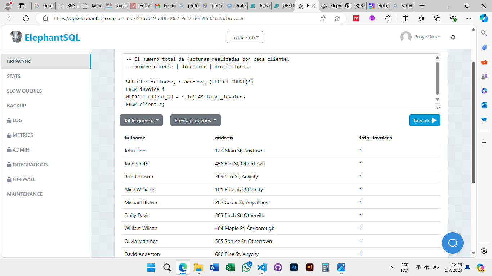
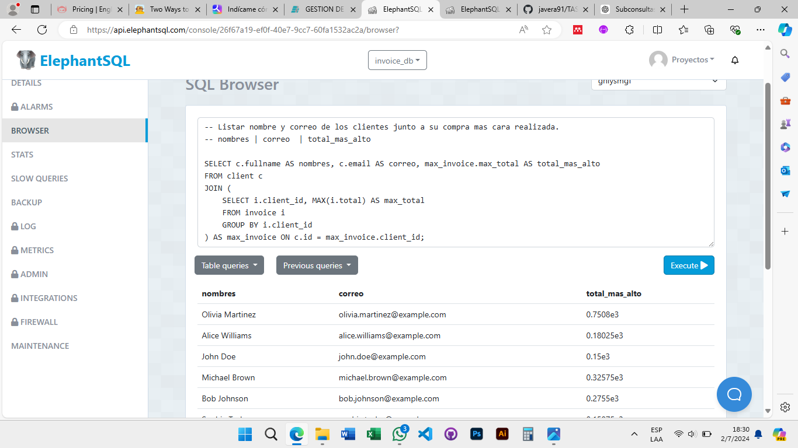
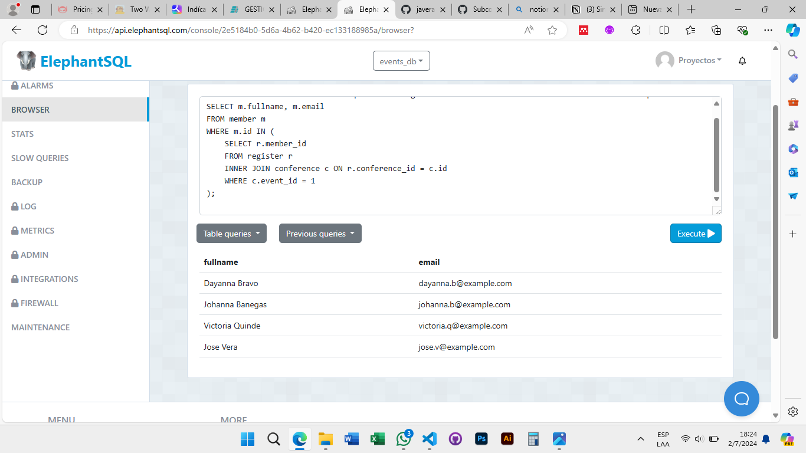
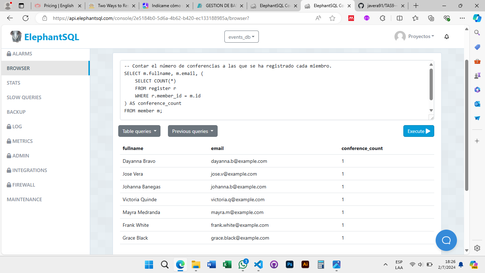

# TAS12 - Subconsultas - INVOICE_DB
## 1. El número total de facturas realizadas por cada cliente. (nombre_cliente | direccion | nro_facturas).
  - Sentencia:
  ```
  SELECT c.fullname, c.address, (SELECT COUNT(*)
  FROM invoice i
  WHERE i.client_id = c.id) AS total_invoices
  FROM client c;
  ```
  - Captura:



## 2. Listar nombre y correo de los clientes junto a su compra mas cara realizada. (nombres | correo | total_mas_alto).
  - Sentencia:
  ```
  SELECT c.fullname AS nombres, c.email AS correo, max_invoice.max_total AS total_mas_alto
  FROM client c
  JOIN (
  SELECT i.client_id, MAX(i.total) AS max_total
  FROM invoice i
  GROUP BY i.client_id
  ) AS max_invoice ON c.id = max_invoice.client_id;
  ```
  - Captura:



## 3. Listar las facturas donde sus totales sean mayores al promedio de las facturas (fecha_factura | total).
  - Sentencia:
  ```
  SELECT i.create_at, i.total
  FROM invoice i
  WHERE i.total > (SELECT AVG(total) FROM invoice);
  ```
  - Captura:


# TAS12 - Subconsultas - EVENT_DB
## 1. Obtener la lista de miembros que se han registrado en al menos una conferencia de un evento específico.
  - Sentencia:
  ```
  SELECT m.fullname, m.email
  FROM member m
  WHERE m.id IN (
  SELECT r.member_id
  FROM register r
  INNER JOIN conference c ON r.conference_id = c.id
  WHERE c.event_id = 1
  );
  ```
  - Captura:



## 2. Contar el número de conferencias a las que se ha registrado cada miembro.
  - Sentencia:
  ```
  SELECT m.fullname, m.email, (
  SELECT COUNT(*)
  FROM register r
  WHERE r.member_id = m.id
  ) AS conference_count
  FROM member m;
  ```
  - Captura:

